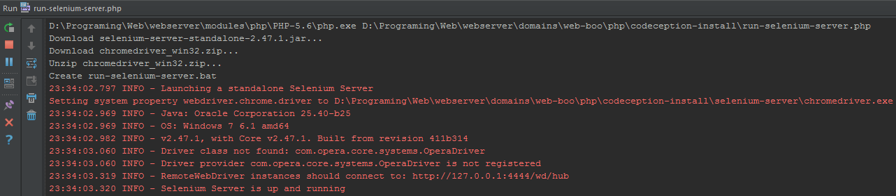

# Install codeception and selenium server in Windows
### Video
[![Install codeception and selenium server, example Yii2)]
(http://img.youtube.com/vi/jR2ksepaTrE/1.jpg)](http://www.youtube.com/watch?v=jR2ksepaTrE)

## 1. Install codeception
+ $ composer require "codeception/codeception:*"
+ $ composer require "codeception/specify=*"
+ $ composer require "codeception/verify=*"
+ create file c:\windows\codecept.bat
```
@ECHO OFF
SET BIN_TARGET={your_path}/codecept/vendor/codeception/codeception/codecept
php "%BIN_TARGET%" %*
```

## 2(a). Selenium server automatic
Download and run [run-selenium-server.php](https://cdn.rawgit.com/ilopX/web-demos/master/demos/console/Codeception-install/run-selenium-server.php)


## 2(b). Selenium server manual
+ [Download](http://www.seleniumhq.org/download) Selenium Standalone Server and put to c:\selenium-server
+ [Download] (http://chromedriver.storage.googleapis.com/index.html) Google Chrome Driver and put to c:\selenium-server
+ Create start-server.bat
```
java -jar c:\selenimu-server\selenium-server-standalone{version}.jar -Dwebdriver.chrome.driver=c:\selenimu-server\chromedriver.exe
```

## Codeception and Selenium server in action

#### PHP codeception and selenium server in firefox (Video)
[![PHP codeception and selenium server in firefox (Video)]
(http://img.youtube.com/vi/tgtKketbQLk/1.jpg)](http://www.youtube.com/watch?v=tgtKketbQLk)

#### PHP codeception and selenium server in Google Chrome Driver (Video)
[![PHP codeception and selenium server in Google Chrome Driver (Video)]
(http://img.youtube.com/vi/YwEOqkWvz3s/1.jpg)](http://www.youtube.com/watch?v=YwEOqkWvz3s)
